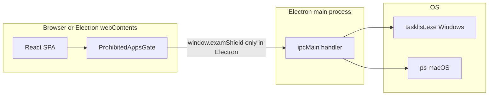

# Anticheating - Deep Architecture Analysis

## 📐 Project Architecture Overview

### Technology Stack
- **Frontend Framework**: React 18.3.1 with TypeScript
- **Build Tool**: Vite 5.4.19 (SWC for fast compilation)
- **Styling**: Tailwind CSS 3.4.17 with custom design system
- **UI Components**: shadcn/ui (48+ components) built on Radix UI
- **AI/ML**: TensorFlow.js 4.22.0
  - BlazeFace model for face detection
  - COCO-SSD model for object detection
- **Backend**: Node.js + Express + MongoDB (Mongoose)
- **AI Agent (Admin)**: OpenAI-compatible chat completion endpoint with heuristic fallback
- **State Management**: TanStack React Query 5.83.0
- **Routing**: React Router DOM 6.30.1
- **Form Handling**: React Hook Form 7.61.1 with Zod validation
- **Testing**: Vitest 3.2.4 with Testing Library
- **Optional desktop shell**: Electron (main + preload) for OS-level process checks; dev orchestration via `concurrently` and `wait-on`

---

## 🏗️ Application Structure

### Directory Hierarchy
```
( repository root )
├── index.html                   # Vite HTML entry
├── package.json
├── vite.config.ts               # Dev server :8080, /api → 127.0.0.1:3000
├── tailwind.config.ts
├── public/                      # Static assets served as-is (e.g. robots.txt, placeholder.svg)
├── electron/                    # Optional Electron desktop shell
│   ├── main.cjs                 # BrowserWindow lifecycle, IPC, tasklist / ps scanning
│   └── preload.cjs              # contextIsolation bridge → window.examShield
├── backend-code/                # Express + MongoDB API (separate Node app; PORT default 3000)
│   ├── server.js                # App bootstrap, CORS, /api/* mounts
│   ├── create-admin.js          # CLI helper to seed an admin user
│   ├── routes/                  # auth, exams, violations, analytics, admin
│   ├── controllers/
│   ├── models/                  # User, Exam, ExamSession, Violation, LoginLog, …
│   └── middleware/              # JWT auth helpers
└── src/
    ├── main.tsx                 # React root
    ├── App.tsx                  # Providers + router
    ├── contexts/
    │   └── AuthContext.tsx      # Login/session state for protected routes
    ├── test/                    # Vitest setup + example tests
    ├── components/              # React components
    │   ├── ui/                  # 48 shadcn/ui components (reusable primitives)
    │   ├── WebcamMonitor.tsx
    │   ├── AudioLevelMeter.tsx
    │   ├── ViolationLog.tsx
    │   ├── ExamTimer.tsx
    │   ├── MonitoringStatus.tsx
    │   ├── ExamQuestions.tsx
    │   ├── ProhibitedAppsGate.tsx  # Pre-exam OS / manual blocked-app gate
    │   ├── UserExamAssistant.tsx
    │   ├── AdminRoute.tsx       # Admin-only route guard
    │   ├── ProtectedRoute.tsx   # Authenticated route guard
    │   └── NavLink.tsx
    ├── config/
    │   └── prohibitedApps.ts    # Blocked apps metadata (keep aligned with electron/main.cjs)
    ├── hooks/                   # Custom React hooks
    │   ├── useWebcam.ts
    │   ├── useAudioMonitor.ts
    │   ├── useBrowserMonitoring.ts
    │   ├── useAIProctoring.ts
    │   ├── useVideoRecording.ts
    │   ├── useScreenshotCapture.ts
    │   ├── use-toast.ts
    │   └── use-mobile.tsx
    ├── pages/                   # Route components
    │   ├── Index.tsx            # Landing page
    │   ├── Login.tsx
    │   ├── Register.tsx
    │   ├── PreExamSetup.tsx     # Rules → checks → calibration → blocked apps → start
    │   ├── ExamPage.tsx         # Main exam interface
    │   ├── StudentDashboard.tsx
    │   ├── AdminDashboard.tsx
    │   ├── Analytics.tsx
    │   └── NotFound.tsx         # 404 handler
    ├── types/
    │   └── examShield.ts        # Types for desktop IPC payloads (where used)
    ├── lib/
    │   ├── api.ts               # API client (uses VITE_API_URL / same-origin /api)
    │   └── utils.ts             # cn() helper for className merging
    └── assets/                  # Static assets (images, etc.)
```

---

## 🖥️ Runtime topology, Electron shell, and prohibited-process gate

### Two ways to run the same React app

| Mode | What runs | Process / Task Manager scan |
|------|-----------|-----------------------------|
| **Browser** | Vite dev server or static `dist/` served over HTTP | **Not possible** (sandbox); pre-exam step uses **manual confirmations** per blocked app |
| **Electron (optional)** | `electron/main.cjs` opens a `BrowserWindow` and loads the same URL (`http://localhost:8080` in dev, `dist/index.html` when packaged) | **Supported**: main process invokes OS tools and returns results over IPC |

A normal webpage cannot enumerate other processes. The desktop shell exists specifically to implement a **pre-exam gate** comparable to checking Task Manager before the timed exam starts.



### npm scripts (exact commands)

| Script | Purpose |
|--------|---------|
| `npm install` | One-time dependency install (root folder) |
| `npm run dev` | Vite dev server — app at **http://localhost:8080** (see `vite.config.ts` for host/port) |
| `npm run electron:dev` | Runs **Vite + Electron** together; waits until `http://127.0.0.1:8080` responds, then opens the shell |
| `npm run electron:open` | **Electron only**; use when `npm run dev` is already running in another terminal (avoids two Vite instances on the same port) |
| `npm run build` | Production bundle to `dist/` |
| `npm run build:dev` | Production bundle in **development** mode (`vite build --mode development`) |
| `npm run preview` | Serves the production build locally (Vite prints the URL, often port **4173**) |
| `npm run lint` | ESLint over the repo |
| `npm test` | Run Vitest once (`vitest run`) |
| `npm run test:watch` | Vitest watch mode |

**Backend (`backend-code/`)** — separate install and scripts:

| Command | Purpose |
|---------|---------|
| `cd backend-code && npm install` | Backend dependencies |
| `npm start` | Run `server.js` (default **PORT=3000** unless `PORT` in `.env`) |
| `npm run dev` | Same with **nodemon** for auto-restart |

**Recommended local flows**

1. **Browser only:** `npm run dev` → open `http://localhost:8080`.
2. **Desktop + real process scan:** Terminal A: `npm run dev` → Terminal B: `npm run electron:open`.
3. **Full stack (login, sessions, violations):** Terminal A: `cd backend-code && npm run dev` → Terminal B: root `npm run dev` (and optional Electron per above).

**Environment:** Create `.env` in the project root when using the real API:

```env
VITE_API_URL=http://localhost:3000/api
```

Vite proxies **`/api`** to **`http://127.0.0.1:3000`** in development (`vite.config.ts`), so the Express/MongoDB backend should listen on port **3000** for same-origin API calls during local work.

**DevTools in Electron:** DevTools are not opened automatically (avoids noisy CDP `Autofill.*` messages). Set `ELECTRON_OPEN_DEVTOOLS=1` in the environment before starting Electron if you want the old auto-open behavior.

**Packaged desktop:** After `npm run build`, Electron loads `dist/index.html` from disk (`app.isPackaged`). Distribution packaging (e.g. `electron-builder`) is not wired in this repo yet; the architecture supports adding it without changing the React pre-exam gate.

### Pre-exam step: `ProhibitedAppsGate` + `window.examShield`

- **UI:** `src/components/ProhibitedAppsGate.tsx` is **Step 4** inside `PreExamSetup.tsx` (5-step wizard). **Continue** to the final step is disabled until the gate passes.
- **Config:** `src/config/prohibitedApps.ts` lists display names and Windows/macOS match hints for the student-facing list.
- **Electron preload** (`electron/preload.cjs`) exposes:
  - `window.examShield.isDesktopShell`
  - `window.examShield.checkProhibitedProcesses()` → `ipcRenderer.invoke('examshield:check-prohibited-processes')`
- **Main process** (`electron/main.cjs`):
  - **Windows:** `tasklist /FO CSV /NH`, parse image names, match against a blocked list (must stay aligned with `prohibitedApps.ts`).
  - **macOS:** `ps -A -o comm=` substring match against the same logical list.
- **Retry loop:** Each **Scan** clears stale results; if any process is still running, the UI lists them; after the student ends tasks in Task Manager / Activity Monitor, they scan again until the list is clear, then proceed.

### concurrently behavior

`electron:dev` runs Vite and Electron in parallel **without** `-k`, so **closing the Electron window does not stop Vite**. Restart Electron with `npm run electron:open` while Vite keeps serving.

---

## 🔄 Data Flow Architecture

### 1. Application Entry Point
```
main.tsx → App.tsx → Router → Pages
```

**App.tsx** provides:
- QueryClientProvider (React Query)
- TooltipProvider (Radix UI)
- Toast notifications (dual system)
- BrowserRouter (React Router)

### 2. State Management Patterns

#### Local State (useState)
- Component-specific UI state
- Form inputs
- Toggle states

#### Ref-based State (useRef)
- MediaStream references
- Model instances (TensorFlow)
- Interval IDs
- Callback references (to avoid stale closures)

#### Context/Provider Pattern
- Toast system uses custom reducer pattern
- `AuthContext` (`src/contexts/AuthContext.tsx`) holds login/session state for protected routes
- React Query for server state (currently minimal usage)

#### Custom Hooks Pattern
All monitoring logic is abstracted into reusable hooks:
- `useWebcam` - Camera stream management
- `useAudioMonitor` - Audio level monitoring
- `useBrowserMonitoring` - Browser event tracking
- `useAIProctoring` - AI model inference
- `useVideoRecording` - Exam session screen/video capture helpers (where used)
- `useScreenshotCapture` - Snapshot capture for violations / evidence (where used)

---

## 🎯 Core Components Deep Dive

### ExamPage.tsx (Main Orchestrator)
**Responsibilities:**
- Coordinates all monitoring systems
- Manages exam lifecycle (start/stop)
- Starts and manages backend exam session ID
- Handles violation aggregation
- Controls fullscreen mode
- Auto-submission logic
- Runs identity enrollment + continuous verification
- Hosts floating user-side AI assistant widget

**State Management:**
```typescript
- violations: Violation[]        // All detected violations
- examFinished: boolean          // Exam completion state
- examSessionId: string | null   // Backend-linked session
```

**Hook Integration:**
```typescript
useWebcam()              → Camera stream
useAudioMonitor()         → Audio levels
useBrowserMonitoring()    → Browser events
useAIProctoring()         → AI detection
```

**Critical Logic:**
- Auto-submission on tab-switch or multiple faces
- Fullscreen enforcement
- Violation aggregation and logging
- Face-only screenshot capture for evidence
- Identity mismatch streak protection (consecutive failures before block)

---

### useAIProctoring Hook
**Architecture:**
```
Model Loading Phase:
  ↓
TensorFlow.js ready
  ↓
Load COCO-SSD (object detection)
Load BlazeFace (face detection)
  ↓
Detection Loop (every 2 seconds)
  ↓
Process video frame
  ↓
Object Detection → Prohibited items
Face Detection → Face count, gaze, obscurity
  ↓
Confidence scoring + sustained-rule engine
  ↓
Violation Reporting (grace + cooldown + critical routing)
```

**Performance Optimizations:**
- Models loaded once and cached in refs
- Detection runs on interval (2s default)
- Grace + cooldown system prevents spam and false positives
- Parallel detection (Promise.all for objects + faces)

**Memory Management:**
- Models stored in refs (persist across renders)
- No model reloading on re-renders
- Cleanup on unmount

**Fairness/Accuracy Enhancements:**
- Confidence scores exposed in detection state:
  - faceVisibility, gazeAway, faceObscured, multipleFaces, prohibitedObject
- Adaptive thresholds from calibration profile:
  - low-light compensation for face confidence
  - face-center/gaze threshold adaptation
- Duration rules for key violations:
  - no-face, multiple-faces, prohibited-object, face-obscured, gaze-away

---

### Pre-Exam Setup + Calibration + Blocked-app gate
**Flow:**
1. Rules acceptance
2. System checks (internet/webcam/mic)
3. Calibration (lighting, face-center, mic baseline)
4. **Close messaging and remote tools** — `ProhibitedAppsGate`: automatic scan in Electron, per-app manual confirmations in a normal browser until all are acknowledged; **Check again** resets so a new attempt re-validates
5. Final summary and **Start exam** (still guarded by `ExamPage` reading `exam_setup_ready`)

**Persisted setup context:**
- `exam_setup_ready` (entry gate token)
- `exam_calibration_profile_v1` (adaptive thresholds profile)

This ensures proctoring starts with device-specific baseline data instead of hardcoded assumptions, and adds an **OS-truthful** blocked-process step when the optional Electron shell is used.

---

### User-Side AI Assistant (Student)
**Component:** `UserExamAssistant`

**Capabilities implemented:**
- Pre-exam readiness coach
- Live compliance coach
- Warning explanations in simple language
- Session helper bot for fix guidance
- Accessibility controls:
  - larger text mode
  - high contrast mode
  - voice hints (speech synthesis)

**UX pattern:**
- Floating AI icon during exam
- Expand/collapse assistant panel on demand

---

### Admin AI Review Agent
**Endpoint:** `GET /api/admin/sessions/:id/ai-summary`

**Behavior:**
- Aggregates session timeline + violation counts + face-evidence flags
- Produces:
  - risk score (0-100)
  - summary
  - flagged reasons
  - recommended manual review actions
  - top evidence timeline
- Uses OpenAI-compatible provider when configured
- Falls back to deterministic heuristic summary if API key is missing

This agent is advisory and does not auto-fail students.

---

### Violation Review Workflow (False-Positive Handling)
**Data model:**
- `review.status`: pending | benign | confirmed
- `review.reviewedBy`, `review.reviewedAt`, `review.note`

**Admin actions:**
- Mark violation as benign (false positive)
- Confirm violation

This introduces fairness controls and auditability for human review.

---

### useWebcam Hook
**Stream Lifecycle:**
```
start() → getUserMedia() → MediaStream
  ↓
Assign to video.srcObject
  ↓
Play video element
  ↓
Sync on active state changes
```

**Edge Cases Handled:**
- Video element mounts after stream creation
- Stream assignment race conditions
- Browser autoplay restrictions
- Cleanup on unmount

---

### useAudioMonitor Hook
**Audio Processing Pipeline:**
```
getUserMedia(audio) → MediaStream
  ↓
AudioContext → AnalyserNode
  ↓
requestAnimationFrame loop
  ↓
getByteFrequencyData() → Average calculation
  ↓
Normalize to 0-100%
  ↓
Threshold check (20%)
  ↓
Violation callback (with 5s cooldown)
```

**Performance:**
- Uses requestAnimationFrame for smooth updates
- FFT size: 256 (balance between accuracy and performance)
- Single analyser node (efficient)

---

### useBrowserMonitoring Hook
**Event Listeners:**
- `visibilitychange` → Tab switch detection
- `copy` / `paste` → Clipboard blocking
- `contextmenu` → Right-click blocking
- `keydown` → Keyboard shortcuts blocking
- `blur` → Window focus loss
- `fullscreenchange` → Fullscreen enforcement
- `keyup` → Screenshot blocking

**Security Measures:**
- Event.preventDefault() on all blocked actions
- Multiple detection methods (visibility + blur)
- Dev tools shortcut blocking (Ctrl+Shift+I, F12)

---

## 🔒 Security Architecture

### Multi-Layer Security

#### Layer 0: OS-level blocked applications (pre-exam, optional)
- Runs only in the **Electron** shell before the student reaches the final **Start exam** control
- Enumerates processes via **Windows `tasklist`** or **macOS `ps`**, not from untrusted JavaScript in the page
- Same React component degrades to **explicit student confirmations** in a plain browser (weaker integrity, documented in UI)
- Blocked program list is duplicated in `electron/main.cjs` and `src/config/prohibitedApps.ts` and must be kept in sync when extending coverage

#### Layer 1: Browser Activity Monitoring
- Tab switching detection
- Copy/paste blocking
- Dev tools prevention
- Screenshot blocking
- Fullscreen enforcement

#### Layer 2: Audio Monitoring
- Real-time audio level tracking
- Threshold-based violation (20%)
- Cooldown to prevent spam

#### Layer 3: Visual AI Monitoring
- Face presence detection
- Multiple face detection (auto-submit)
- Gaze tracking (head position)
- Face obscurity detection
- Prohibited object detection (mobile phones, books, etc.)
- Identity enrollment + continuous face verification
- Adaptive thresholds from calibration profile
- Confidence-scored detections

#### Layer 4: Violation System
- Timestamped violation logging
- Real-time toast notifications
- Violation count tracking
- Auto-submission on critical violations
- Face-related screenshot evidence only
- Admin false-positive review states (benign/confirmed)

---

## 🎨 UI/UX Architecture

### Design System
**Color Palette:**
- Dark theme with HSL-based variables
- Primary: Teal/Cyan (180° hue)
- Destructive: Red (0° hue)
- Warning: Yellow (38° hue)
- Success: Green (142° hue)

**Custom Utilities:**
- `.glow-teal` - Primary glow effect
- `.glow-red` - Warning glow effect
- `.gradient-card` - Card background
- `.gradient-hero` - Hero section background
- `.pulse-dot` - Animated indicator
- `.scan-line` - Security scan animation

**Component Patterns:**
- All UI components use shadcn/ui primitives
- Consistent spacing with Tailwind
- Responsive design (mobile-first)
- Accessibility built-in (Radix UI)

---

## ⚡ Performance Considerations

### Optimizations Implemented

1. **React Optimizations:**
   - `useCallback` for event handlers
   - `useRef` for stable references
   - Memoization where needed
   - Proper dependency arrays

2. **AI Model Loading:**
   - Lazy loading (dynamic imports)
   - Model caching in refs
   - Parallel model loading (Promise.all)

3. **Detection Intervals:**
   - 2-second detection interval (configurable)
   - Cooldown system prevents excessive violations
   - requestAnimationFrame for smooth audio updates

4. **Memory Management:**
   - Proper cleanup in useEffect returns
   - Stream track stopping
   - AudioContext closure
   - Interval clearing

5. **Bundle Optimization:**
   - Vite for fast builds
   - SWC for fast compilation
   - Tree-shaking enabled
   - Code splitting potential

---

## 🧪 Testing Strategy

### Current Setup
- Vitest for unit testing
- Testing Library for component testing
- jsdom for DOM simulation
- Basic example test included

### Recommended Testing Areas
1. **Unit Tests:**
   - Hook logic (violation detection)
   - Utility functions
   - State management

2. **Integration Tests:**
   - Component interactions
   - Hook integration
   - Violation flow

3. **E2E Tests:**
   - Full exam flow
   - Violation detection
   - Auto-submission

---

## 🚀 Deployment Considerations

### Build Configuration
- Production build: `npm run build`
- Development build: `npm run build:dev`
- Preview: `npm run preview`

### Hosting the SPA vs shipping the desktop shell
- **Static / CDN + browser:** Deploy the Vite `dist/` output behind HTTPS. Students get the **manual** blocked-app gate unless you later add a signed native helper or institution-managed endpoint (not in this repo).
- **Electron artifact:** Build the web app first, then point Electron at `dist/` (already how `app.isPackaged` works in `electron/main.cjs`). Add a packager when you need a single `.exe` / `.dmg` installer.

### Environment Requirements
- HTTPS required for camera/microphone access
- Modern browser with WebRTC support
- TensorFlow.js model loading (CDN or local)
- **Node.js 18+** recommended for local development and builds

### Performance Metrics
Approximate figures for planning; measure in your own build, network, and device profile:
- Initial load: ~2-3MB (with models)
- Model loading: ~5-10 seconds
- Detection latency: ~2 seconds
- Memory usage: ~100-200MB (with models)

---

## 🔧 Areas for Improvement

### 1. Storage Strategy
- **Current**: Base64 screenshots in DB
- **Potential**: Object storage (S3/Cloudinary) + signed URLs
- **Benefits**: Smaller DB load, faster admin pages, scalable retention

### 2. Configurable Proctoring Policies
- **Current**: Calibration + static defaults
- **Potential**: Exam-level policy templates (strict/moderate/accessibility)
- **Benefits**: Better fairness across exam types

### 3. Assistant Hardening
- **Current**: Rule-based helper + admin AI summary
- **Potential**: Retrieval-grounded policy assistant, multilingual support
- **Benefits**: Safer and clearer guidance

### 4. Session Analytics
- **Current**: Session list + AI summary dialog
- **Potential**: Timeline playback and trend analytics per student/device

### 5. Reliability/Observability
- Structured logs, request tracing, and alerting for model/API failures

### 6. Accessibility Expansion
- Screen reader optimized assistant, keyboard shortcuts, translated voice prompts

### 7. Privacy and Compliance
- Data retention automation and per-org compliance policy controls

---

## 📊 Technical Metrics

### Code Statistics
- **Total Components**: ~60+ (including UI components)
- **Custom Hooks**: 6
- **Pages**: 7+ (including setup, admin, student, analytics)
- **Lines of Code**: ~3000+ (estimated)

### Dependencies
- **Production**: 30+ packages
- **Development**: 15+ packages
- **Bundle Size**: ~2-3MB (gzipped)

### Browser Support
- Chrome/Edge: Full support
- Firefox: Full support
- Safari: Full support (with limitations)
- Mobile: Limited (camera access restrictions)

---

## 🎓 Learning Resources

### Key Concepts Used
1. **React Hooks Pattern**: Custom hooks for reusable logic
2. **Ref Pattern**: Stable references, avoiding re-renders
3. **Callback Pattern**: Preventing stale closures
4. **Event-Driven Architecture**: Browser event monitoring
5. **AI/ML Integration**: TensorFlow.js in browser
6. **MediaStream API**: Camera and microphone access
7. **Web Audio API**: Audio analysis
8. **Design System**: Consistent UI with Tailwind

---

## 🔮 Future Enhancements

1. **Real-time Communication**: WebSocket push for live proctor/admin updates
2. **Vision-Language Review**: Optional image-aware admin AI evidence analysis
3. **Policy Engine**: Rule configuration UI for violations and severity
4. **Advanced Analytics**: Drift analysis by device, lighting, and network profiles
5. **Export Pipelines**: PDF audit packets and regulator-friendly logs
6. **Multi-tenancy**: Institution-level isolation and configuration
7. **Model Ops**: Threshold tuning dashboards and model version tracking

---

This architecture provides a solid foundation for an AI-powered exam proctoring system with room for scalability and enhancement.
